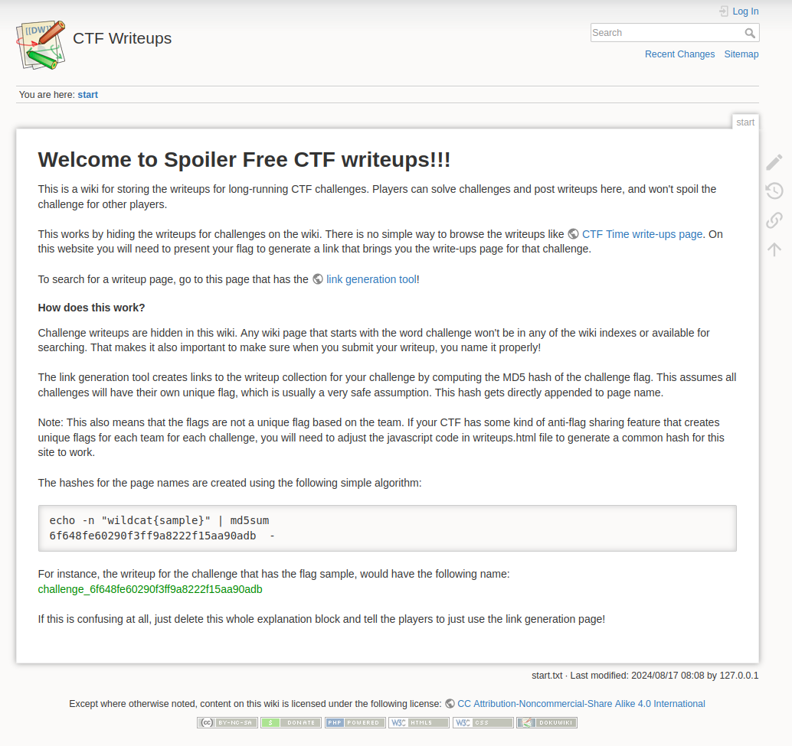
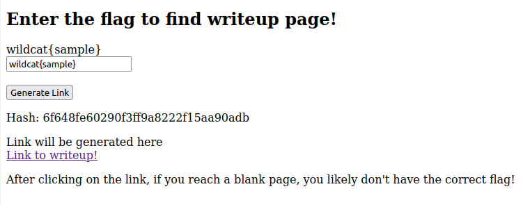
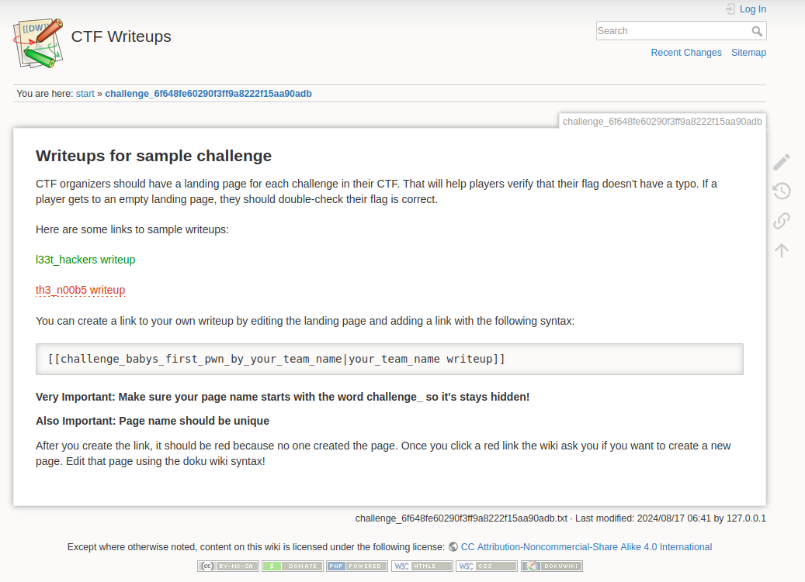
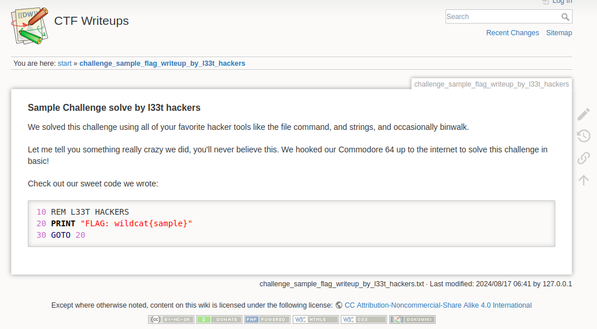

# Spoiler Free CTF Writeup CMS

Customized Doku wiki to create a platform where students can post writeups for
CTF challenges.  But the writeups can only be viewed if the student already
knows the challenge flag.

Our high schools CTF runs all year long.  Experienced students will complete
challenges faster, and can create their own writeups, and see the challenge
creator's official writeup to see how the intended solution worked.  But new
students can't see the writeups until they solve the challenge later.  This
preserves the challenge for the newer students.  CTF administrators can add
bonus points to the teams that complete best writeups to encourage more
writeups.

# Default accounts and credentials

| Username      | Password        | Group          | Notes                                                     |
| --------------| --------------- | -------------- | --------------------------------------------------------- |
| admin         | password        | admin          | Can access media manager (see index of pictures uploaded) |
| student       | password2       | studentgroup   |                                                           |

By default, the wiki will allow anonymous editting.

You can login as the admin, and reconfigure the ACL to only have @ALL be able to read the wiki, and then add
the edit permission for the studentgroup to moderately control the wiki from defacement.

You could also add many individual students and put all of them in the studentgroup group and more tightly
control access

# Customizations performed on standard doku install for this project

* Installed the 2 accounts listed above, enabled ACL
* Installed the disableactionsbygroup plugin to hide the media manager from
  anonymous and students (you can normally browse the media manager and see
  all the pictures uploaded)
* Installed custom configuration
  * Changed the title to "CTF Writeups"
  * Hide recent pages (recent, recent_days)
  * Hide page navigation stuff (breadcrumbs, youarehere)
  * Any page that starts with the name chal is hidden from wiki index (hidepages)
  * Hide the media manager from most users (disableactions, disableactionsbygroup).
    Only admins can see it
  * Disable auto updates (updatecheck)

# How to install

## From git:

```
cd spoiler_free_ctf_writeups
git submodule update --init --recursive
docker build -t ctf_wiki
docker run -d -p 5658:80 --restart unless-stopped ctf_wiki
```

## From docker hub

```
docker pull mwales/spoiler_free_ctf_writeups
docker run -d -p 5658:80 --restart unless-stopped mwales/spoiler_free_ctf_writeups
```

## Customization required

You can replace port 5658 with any port number that you want.

After you start the container.  Login using the administrator and update the administrator account
password.

If you want to disable anonymous edits, change the student password and update the ACL settings.

On the start page, the link to the "link generation tool" is an exteral link that just has the
localhost IP address, update this link to point at the server's domain name and the port that
you exposed for docker.

Update the graphics using the media manager under the admin account

Add placeholder landing pages for each challenge (add a short placehold page for each flag in your
CTF).

# Screenshots









